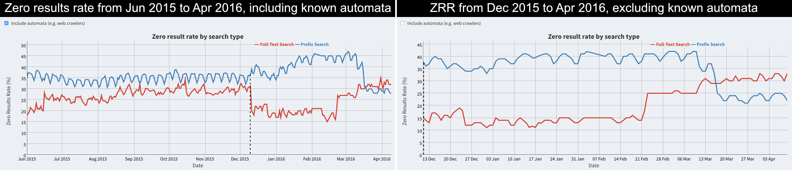

```{r setup, include=FALSE}
knitr::opts_chunk$set(echo = FALSE, message = FALSE, warning = FALSE)
```

\renewcommand{\abstractname}{Executive Summary}
\begin{abstract}
...
\end{abstract}

## Introduction

Last December (2015) we switched our dashboard data collection process to compute the zero results rate (ZRR) using the Cirrus search request logs stored in our Hadoop cluster, instead of the Python script that was operating on raw logs (see **[T117915](https://phabricator.wikimedia.org/T117915)**). Around the same time, we also made a switch to output two zero results rates: one including known automata, and one excluding known automata (see **[T121434](https://phabricator.wikimedia.org/T121434)**). While the automata detection was/is rudimentary, it nevertheless helped us see a more accurate picture of the zero results rate over time, one that reflected our human users' experience with search.



Of note is the jump in full-text ZRR on 22 Feb 2016 and 23 Feb 2016, with an increase over time since then. Let us see if we can identify the obvious possibilities for this phenomenon. On the dashboard data collection side, there were no changes to the zero results rate Hive query / R script (see **[commits](https://git.wikimedia.org/log/wikimedia%2Fdiscovery%2Fgolden.git)**). And completion suggester was not rolled out until Wednesday, 16 March 2016 (see **[discovery-private mailing list](https://lists.wikimedia.org/mailman/private/discovery-private/2016-March/001839.html)**). Having eliminated the most obvious points of failure, we know that something else must be going on. This report is an attempt to figure out what that something else might possibly be.
