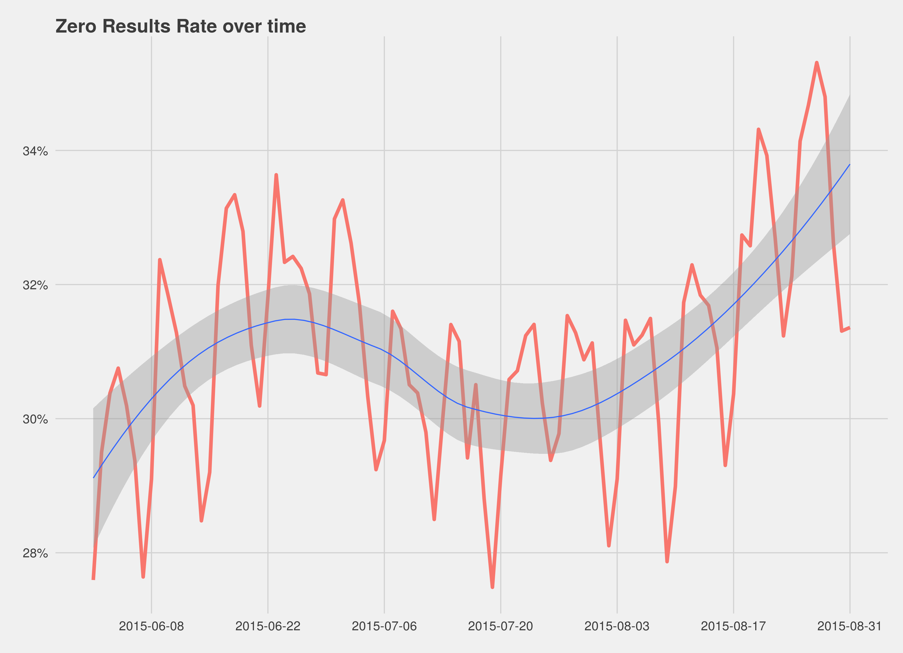

## Background

One of the core Key Performance Indicators (KPIs) for the Discovery team this quarter is the Zero Results Rate; the rate
at which search requests fail to return any results. Our goal for the quarter is to reduce it from the 25% at which it stood at
the beginning of the quarter to 15% by the end.

Rather than see this rate decrease, however, we have actually seen it *increase*, particularly in the context of full-text searches.
Our task with this report is to explore some hypotheses for where this increase could be coming from.

In doing this we are heavily limited by the data we have access to, to the point where answering the question directly by exploring all hypotheses is impossible. This is because the logs that note whether queries returned zero results do *not* note anything about the
user, so doing things like detecting automata is impossible.

## Exploratory data analysis

One important early piece is to explore the premise of the question; *is* the Zero Results Rate going up?

If we examine the overall ZRR (Fig. 1) we see there absolutely is an increase over time (as well as, of unrelated interest, a clear
weekly pattern). To dig into this more we can look at the rate broken down by full-text and prefix search:

Again, we see an increase (Fig. 2) but that increase isn't even. In particular we see a massive jump in the full-text search rate on 16 June 2015 that is not found with prefix search requests, and never went away, inflating the baseline.

## Hypotheses

We can construct a number of hypotheses (some explorable, some not) as to why the rate is increasing, namely:

* Some form of automata was triggered on 16 June, and is misbehaving (and continuing), causing the underlying boost in full-text failures;
* Multiple forms of automata have been triggered, and are misbehaving and causing the underlying boost.
* This is simply a seasonal pattern we have not seen before because we haven't been looking at search before;
