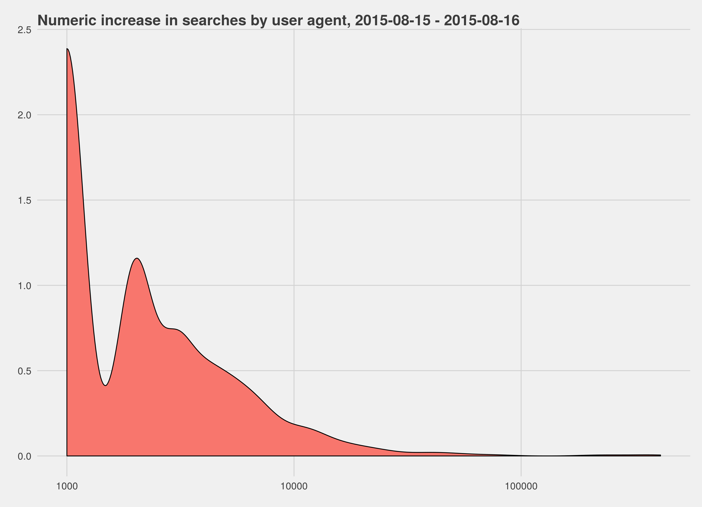
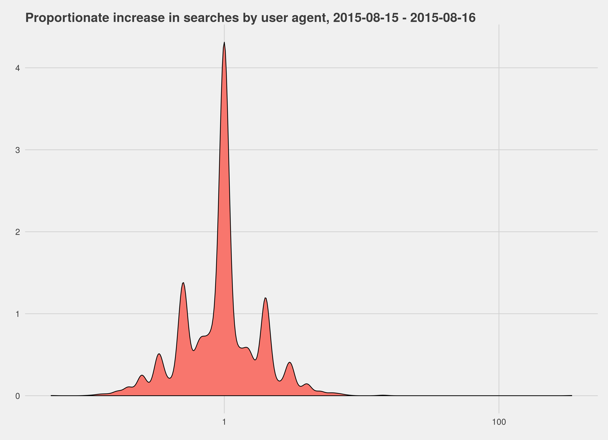
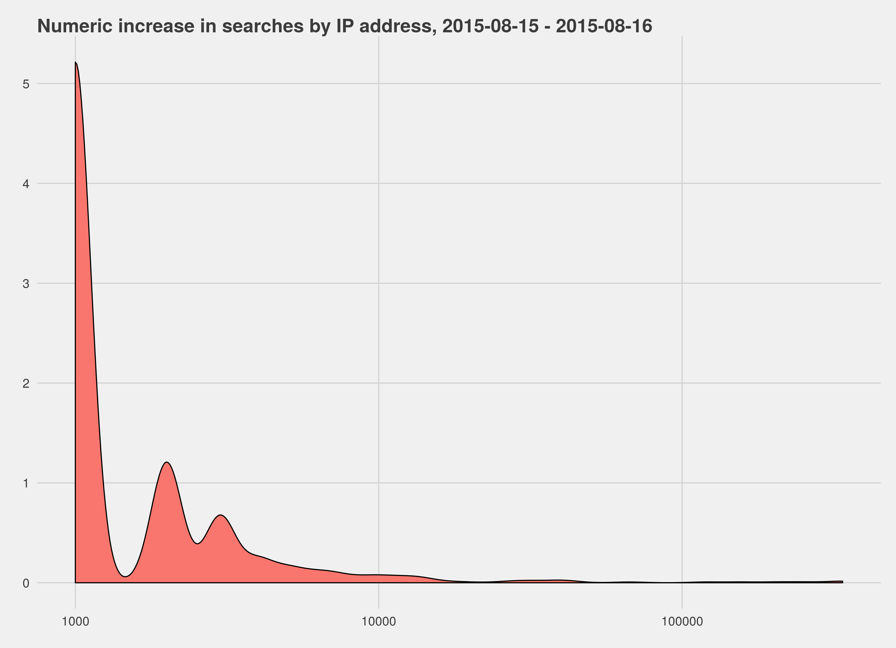
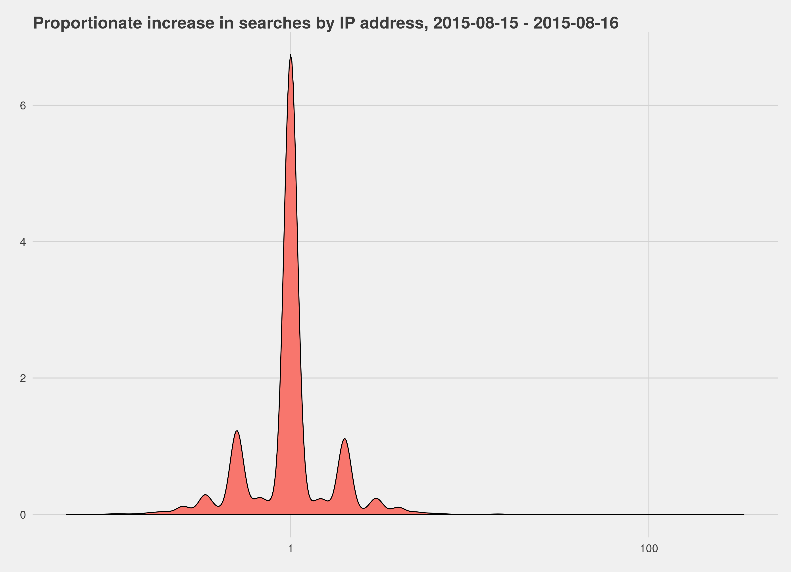

## Background

One of the core Key Performance Indicators (KPIs) for the Discovery team this quarter is the Zero Results Rate; the rate
at which search requests fail to return any results. Our goal for the quarter is to reduce it from the 25% at which it stood at
the beginning of the quarter to 15% by the end.

Rather than see this rate decrease, however, we have actually seen it *increase*, particularly in the context of full-text searches.
Our task with this report is to explore some hypotheses for where this increase could be coming from.

In doing this we are heavily limited by the data we have access to, to the point where answering the question directly by exploring all hypotheses is impossible. This is because the logs that note whether queries returned zero results do *not* note anything about the
user, so doing things like detecting automata is impossible.

## Exploratory data analysis

One important early piece is to explore the premise of the question; *is* the Zero Results Rate going up?

If we examine the overall ZRR (Fig. 1) we see there absolutely is an increase over time (as well as, of unrelated interest, a clear
weekly pattern). To dig into this more we can look at the rate broken down by full-text and prefix search:

Again, we see an increase (Fig. 2) but that increase isn't even. In particular we see a massive jump in the full-text search rate on 16 June 2015 that is not found with prefix search requests, and never went away, inflating the baseline.

## Hypotheses

We can construct a number of hypotheses (some explorable, some not) as to why the rate is increasing, namely:

* Some form of automata was triggered on 16 June, and is misbehaving (and continuing), causing the underlying boost in full-text failures;
* Multiple forms of automata have been triggered, and are misbehaving and causing the underlying boost;
* This is simply a seasonal pattern we have not seen before because we haven't been looking at search before.

## Automata on 16 June

One of the massive limitations that we have in terms of data sources is that we have no way of reliably associating IP addresses and user agents with search requests - the logs that contain searches and, crucially, *whether they produced any results*, do not contain other sensitive information. The logs that *do* do not contain the results count.

Accordingly the only way we have of exploring this is to look at the access logs, which contain IP and user agent data and enough information to determine if a request *was* a search, but not enough to determine what the outcome of that search was in terms of a result count. We can hypothesise that a change in automata behaviour would show itself as a change in *overall* incoming searches, and look for it there.

To do this analysis we looked at the sampled request logs from 15 and 16 June 2015, since 16 June was when the massive spike began. We filtered requests down to searches, which came to 285m events over both days. The existing data sources show a 7% increase in the ZRR, while these logs show a 9% increase in searches overall.

We first examined the user agents, looking distinctly at user agents that appeared on 16 June, having not been present on 15 June, and the numeric and proportionate difference between traffic from user agents that had appeared on both days. In the case of "new" user agents no substantial amount of traffic was seen (the highest from a new agent was 17k searches, which is a drop in the bucket). If we look at the distribution in changes for existing user agents:

The variation is positive for pretty much all user agents (Fig.3) but not tremendously positive; we're looking at changes on the scale of tens or hundreds of thousands, not the millions we'd expect to be looking at if new or massively boosted automata were the source of the change. If we examine the actual values we see that the largest change is 411,000 additional requests - and that comes from Chrome 43.

Examining proportionate changes (Fig.4) shows again, that the increase is pretty broadly spread but does cluster - most proportionate increases are around 1-10%, not bigger. Again, hand-coding revealed very little of interest, minus additional traffic from [Lagotto](https://github.com/lagotto/lagotto) which (while substantial) is not substantial enough to be causing the effect we see there.

If we look at the change in the distribution over IP addresses, we see much the same pattern:

Most changes are not numerically high (Fig.5 - the highest is 338k additional requests from a particular IP address) and neither are they proportionately high. If there *is* a single party (or multiple parties) responsible for this, it's not something we can pick out without knowing the outcome of each search query.

## Automata over time

One thing that we have very deliberately not done as a team is excluded automata and crawlers from our dashboards. This is because API traffic is important to us - we want to be providing a good search experience for *everyone*, humans and reusers alike. A side effect of this, though, is that we do not have existing systems to *measure* automata, or know what the zero results rate looks like if we exclude them.

Using the logs from our A/B tests we can get a sample of traffic with both the zero results rate *and* the user agent and IP address,
and examine it for probable automata, letting us see whether the secondary rise (in August 2015) is down to a rise in automata behaviour,
and what the traffic would look like without automata.